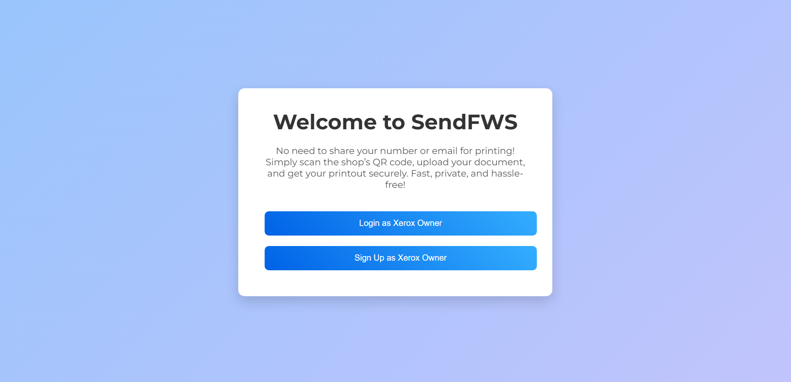
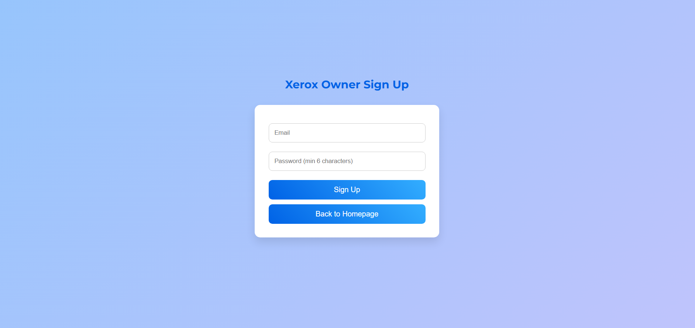
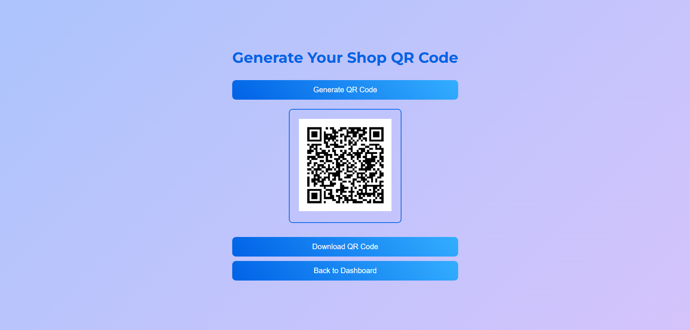
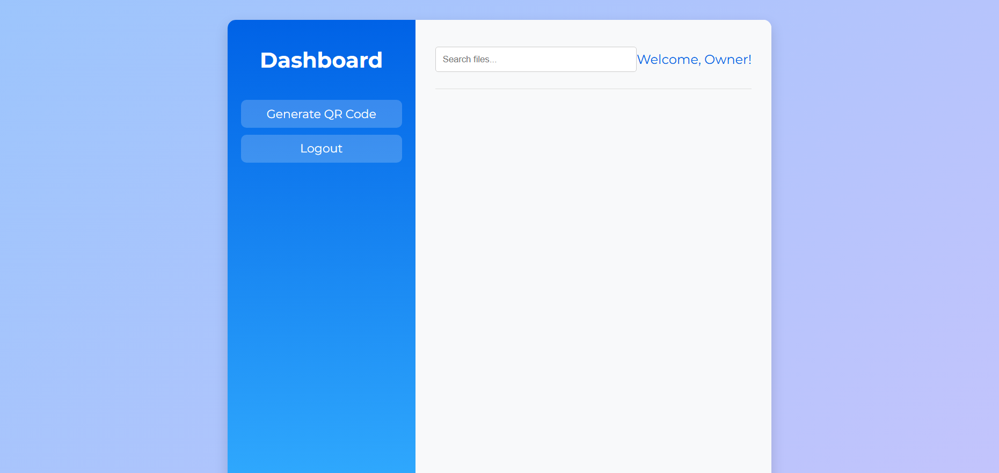

# SendFWS 🚀

A secure, QR-based file transfer system – no login required, files auto-delete after print/download.

🌐 **Live Demo:** [sendfws.web.app](https://sendfws.web.app)

---

## 🛠️ Tech Stack

- 🔧 HTML, CSS, JavaScript
- 🔐 Firebase (Auth, Firestore, Hosting, Storage)
- 📦 SQL (for structured data - if applicable)

---

## 📦 Features

- 🔐 Secure file uploads via QR Code
- 🧾 Auto-delete after printing or download
- 🔍 Real-time file tracking (admin only)
- 📱 Works across devices (desktop/mobile)
- 🧠 Only app operator knows secure file ID

---

## 📸 Screenshots

### 🏠 Home Page

### 📤 Signup Page

### 📋 New Qr Page

---

## 🔐 Security Highlights

- ✅ Files stored with unique, random IDs
- ✅ Auto-deletion ensures no file history is retained
- ✅ Access is QR-based — no authentication required
- ✅ Admin-only real-time view of file activity

### 🛡️ Admin Tracking Dashboard

